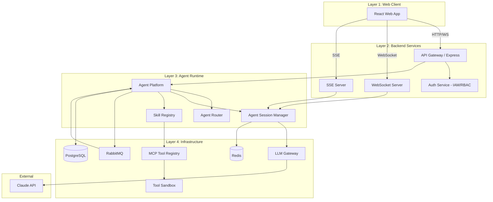
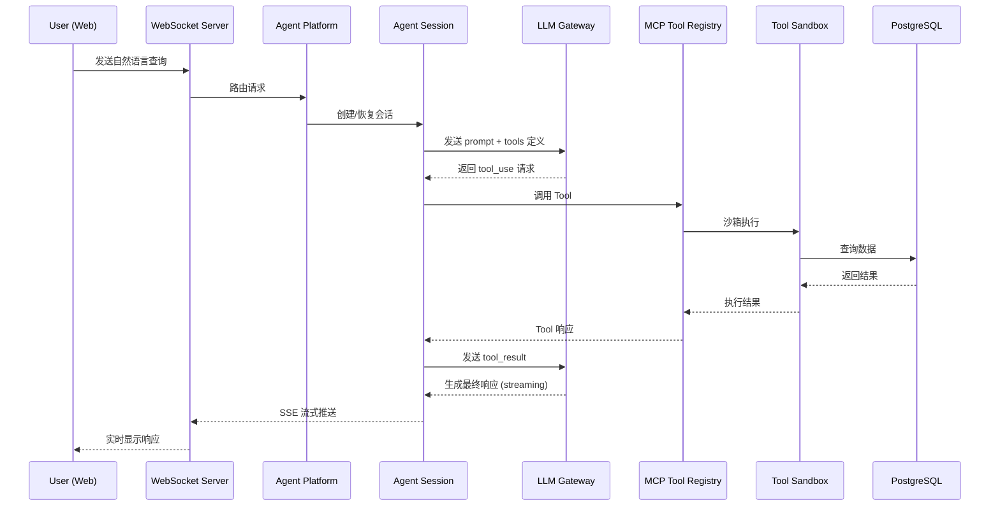

# Design Document: OMS AI Native M1

## Overview

本设计文档描述 OMS AI Native 系统 M1 里程碑的技术架构和实现方案。M1 聚焦于搭建系统基础设施层（Layer 4）和 Agent Platform（Layer 3 核心），并交付首个可运行的订单查询 Domain Agent 作为端到端验证。

### 设计目标

1. **LLM 接入能力**：通过统一网关接入 Claude API，支持流式响应和多租户隔离
2. **标准化 Tool 层**：基于 MCP 协议实现 Tool 的注册、发现和安全调用
3. **消息驱动架构**：通过 RabbitMQ 实现模块间异步通信和事件驱动
4. **Agent 平台**：实现 Agent 的注册、生命周期管理和请求分发
5. **端到端验证**：交付订单查询 Agent，验证整体架构的可行性

### 技术选型

| 组件 | 技术 | 选型理由 |
|------|------|---------|
| 前端 | React + WebSocket + SSE | 组件化开发，实时通信支持好 |
| 后端 | Node.js + Express | 异步 I/O 适合 Agent 场景，生态丰富 |
| Agent Runtime | Claude Agent SDK + MCP | 官方 SDK 稳定性好，MCP 是标准协议 |
| LLM | Claude API | 工具调用能力强，推理质量高 |
| 消息队列 | RabbitMQ | 支持多种消息模式，运维成熟 |
| 业务数据库 | PostgreSQL | ACID 事务，JSON 支持好 |
| 缓存/会话 | Redis | 高性能 KV 存储，支持 TTL |
| 沙箱 | Docker 容器 + V8 Isolate | Docker 提供强隔离，V8 Isolate 轻量快速 |
| 调度器 | Bull (基于 Redis) | Node.js 生态，支持 Cron 和延迟任务 |

---

## Architecture

### 系统架构图



### 请求处理流程



### 分层职责

| 层级 | 职责 | 关键组件 |
|------|------|---------|
| Layer 2 - Backend | 请求入口、认证鉴权、实时通信 | API Gateway, WebSocket Server, Auth Service |
| Layer 3 - Agent Runtime | Agent 管理、会话管理、技能编排 | Agent Platform, Agent Router, Session Manager |
| Layer 4 - Infrastructure | LLM 接入、Tool 执行、消息通信、数据存储 | LLM Gateway, MCP Registry, Sandbox, RabbitMQ, PostgreSQL, Redis |

---

## Components and Interfaces

### 1. LLM Gateway

**职责**：统一管理 Claude API 的接入，提供标准化调用接口、流式响应、配额管理和错误处理。

```typescript
interface LLMGatewayConfig {
  tenantId: string;
  apiKey: string;
  model: string;           // e.g., "claude-sonnet-4-20250514"
  maxTokens: number;
  rateLimit: number;       // requests per minute
}

interface LLMRequest {
  tenantId: string;
  sessionId: string;
  messages: Message[];
  tools?: ToolDefinition[];
  stream: boolean;
  maxTokens?: number;
}

interface LLMResponse {
  id: string;
  content: ContentBlock[];
  usage: { inputTokens: number; outputTokens: number };
  stopReason: 'end_turn' | 'tool_use' | 'max_tokens';
}

interface LLMGateway {
  // 同步调用
  complete(request: LLMRequest): Promise<LLMResponse>;
  // 流式调用
  stream(request: LLMRequest): AsyncIterable<StreamEvent>;
  // 配额查询
  getUsage(tenantId: string, period: string): Promise<UsageStats>;
}
```

### 2. Agent SDK Wrapper

**职责**：封装 Claude Agent SDK，提供工具调用协议转换、上下文管理和会话压缩。

```typescript
interface AgentSDKConfig {
  llmGateway: LLMGateway;
  contextWindowSize: number;  // max tokens
  compressionThreshold: number; // trigger compression at this %
}

interface AgentContext {
  sessionId: string;
  messages: Message[];
  tools: ToolDefinition[];
  systemPrompt: string;
  metadata: Record<string, unknown>;
}

interface AgentSDKWrapper {
  // 创建新会话
  createSession(agentId: string, tenantId: string, userId: string): Promise<AgentSession>;
  // 发送消息并获取响应
  chat(session: AgentSession, userMessage: string): AsyncIterable<AgentEvent>;
  // 压缩上下文
  compressContext(session: AgentSession): Promise<void>;
  // 关闭会话
  closeSession(sessionId: string): Promise<void>;
}

type AgentEvent =
  | { type: 'text_delta'; content: string }
  | { type: 'tool_use'; toolName: string; input: unknown }
  | { type: 'tool_result'; toolName: string; output: unknown }
  | { type: 'end'; usage: UsageStats }
  | { type: 'error'; error: AgentError };
```

### 3. MCP Tool Registry

**职责**：管理 Tool 的注册、发现、参数校验和调用分发。

```typescript
interface MCPToolDefinition {
  name: string;
  description: string;
  inputSchema: JSONSchema;
  outputSchema: JSONSchema;
  version: string;
  permissions: string[];     // required permissions to call
  timeout: number;           // max execution time in ms
  sandbox: 'docker' | 'v8-isolate';
}

interface ToolCallRequest {
  toolName: string;
  input: unknown;
  callerId: string;          // agent or user ID
  tenantId: string;
  traceId: string;
}

interface ToolCallResult {
  success: boolean;
  output?: unknown;
  error?: { code: string; message: string };
  executionTime: number;
}

interface MCPToolRegistry {
  // Tool 管理
  register(tool: MCPToolDefinition): Promise<void>;
  unregister(toolName: string): Promise<void>;
  discover(filter?: ToolFilter): Promise<MCPToolDefinition[]>;
  // Tool 调用
  invoke(request: ToolCallRequest): Promise<ToolCallResult>;
  // 参数校验
  validate(toolName: string, input: unknown): ValidationResult;
}
```

### 4. Tool Sandbox

**职责**：在隔离环境中安全执行 Tool，限制资源使用。

```typescript
interface SandboxConfig {
  type: 'docker' | 'v8-isolate';
  cpuLimit: number;          // CPU shares
  memoryLimit: number;       // bytes
  timeoutMs: number;
  networkPolicy: NetworkPolicy;
  allowedPaths: string[];
}

interface SandboxExecution {
  toolName: string;
  code: string | Function;
  input: unknown;
  config: SandboxConfig;
}

interface ToolSandbox {
  execute(execution: SandboxExecution): Promise<ToolCallResult>;
  terminate(executionId: string): Promise<void>;
  getStatus(executionId: string): Promise<ExecutionStatus>;
}
```

### 5. Message Broker (RabbitMQ)

**职责**：提供异步消息通信，支持点对点和发布/订阅模式。

```typescript
interface MessageBrokerConfig {
  url: string;
  exchanges: ExchangeConfig[];
  queues: QueueConfig[];
  deadLetterExchange: string;
}

interface PublishOptions {
  exchange: string;
  routingKey: string;
  persistent: boolean;
  headers?: Record<string, string>;
}

interface MessageBroker {
  // 发布消息
  publish(topic: string, message: unknown, options?: PublishOptions): Promise<void>;
  // 订阅消息
  subscribe(topic: string, handler: MessageHandler): Promise<Subscription>;
  // 点对点发送
  send(queue: string, message: unknown): Promise<void>;
  // 监控
  getQueueStats(queue: string): Promise<QueueStats>;
}

type MessageHandler = (message: BrokerMessage) => Promise<void>;
```

### 6. Database Service

**职责**：提供统一的数据访问层，管理连接池和多租户隔离。

```typescript
interface DatabaseServiceConfig {
  postgres: {
    host: string;
    port: number;
    database: string;
    poolSize: number;
  };
  redis: {
    host: string;
    port: number;
    maxConnections: number;
  };
}

interface DatabaseService {
  // PostgreSQL 操作
  query<T>(sql: string, params: unknown[], tenantId: string): Promise<T[]>;
  transaction<T>(fn: (tx: Transaction) => Promise<T>): Promise<T>;
  migrate(direction: 'up' | 'down'): Promise<void>;
  // Redis 操作
  cacheGet<T>(key: string): Promise<T | null>;
  cacheSet(key: string, value: unknown, ttlSeconds?: number): Promise<void>;
  cacheDel(key: string): Promise<void>;
}
```

### 7. Agent Platform

**职责**：Agent 的注册、生命周期管理、请求路由和分发。

```typescript
interface AgentDefinition {
  id: string;
  name: string;
  type: string;              // e.g., 'order-query', 'onboarding'
  version: string;
  description: string;
  tools: string[];           // allowed tool names
  systemPrompt: string;
  config: Record<string, unknown>;
}

type AgentStatus = 'registered' | 'ready' | 'running' | 'paused' | 'stopped';

interface AgentInstance {
  id: string;
  definitionId: string;
  tenantId: string;
  status: AgentStatus;
  activeSessions: number;
  createdAt: Date;
  updatedAt: Date;
}

interface AgentPlatform {
  // Agent 管理
  registerAgent(definition: AgentDefinition): Promise<AgentInstance>;
  updateAgent(id: string, updates: Partial<AgentDefinition>): Promise<void>;
  getAgent(id: string): Promise<AgentInstance>;
  listAgents(filter: AgentFilter): Promise<AgentInstance[]>;
  // 生命周期
  startAgent(id: string): Promise<void>;
  pauseAgent(id: string): Promise<void>;
  stopAgent(id: string): Promise<void>;
  // 请求路由
  route(request: AgentRequest): Promise<AgentInstance>;
}
```

### 8. Auth Service

**职责**：IAM SSO 认证和 RBAC 权限控制。

```typescript
interface AuthConfig {
  ssoProvider: string;
  jwtSecret: string;
  tokenExpiry: number;
}

interface User {
  id: string;
  tenantId: string;
  roles: string[];
  permissions: string[];
}

interface AuthService {
  // 认证
  authenticate(token: string): Promise<User>;
  // 授权
  authorize(user: User, resource: string, action: string): boolean;
  // Token 管理
  generateToken(user: User): string;
  refreshToken(token: string): string;
}
```

### 9. WebSocket / SSE Communication

**职责**：管理用户与 Agent 之间的实时双向通信。

```typescript
interface WebSocketManager {
  // 连接管理
  handleConnection(ws: WebSocket, userId: string, tenantId: string): void;
  handleDisconnect(connectionId: string): void;
  // 消息发送
  sendToUser(userId: string, event: AgentEvent): void;
  broadcastToTenant(tenantId: string, event: SystemEvent): void;
  // 会话管理
  getActiveConnections(userId: string): ConnectionInfo[];
}

interface SSEManager {
  // 流式推送
  createStream(res: Response, sessionId: string): SSEStream;
  pushEvent(stream: SSEStream, event: AgentEvent): void;
  closeStream(stream: SSEStream): void;
}
```

### 10. Order Query Agent (Domain Agent)

**职责**：解析用户自然语言查询意图，调用订单查询 Tool 返回结果。

```typescript
interface OrderQueryTool {
  name: 'query_orders';
  description: '查询订单信息';
  inputSchema: {
    orderNo?: string;
    status?: OrderStatus;
    startDate?: string;
    endDate?: string;
    shopId?: string;
    page?: number;
    pageSize?: number;
  };
}

interface OrderQueryResult {
  orders: Order[];
  total: number;
  page: number;
  pageSize: number;
}
```

---

## Data Models

### PostgreSQL Schema

#### tenants 表

```sql
CREATE TABLE tenants (
  id UUID PRIMARY KEY DEFAULT gen_random_uuid(),
  name VARCHAR(255) NOT NULL,
  config JSONB DEFAULT '{}',
  api_key_encrypted TEXT,
  rate_limit INTEGER DEFAULT 60,
  status VARCHAR(50) DEFAULT 'active',
  created_at TIMESTAMP DEFAULT NOW(),
  updated_at TIMESTAMP DEFAULT NOW()
);
```

#### users 表

```sql
CREATE TABLE users (
  id UUID PRIMARY KEY DEFAULT gen_random_uuid(),
  tenant_id UUID NOT NULL REFERENCES tenants(id),
  email VARCHAR(255) NOT NULL,
  name VARCHAR(255),
  roles TEXT[] DEFAULT '{}',
  permissions TEXT[] DEFAULT '{}',
  status VARCHAR(50) DEFAULT 'active',
  created_at TIMESTAMP DEFAULT NOW(),
  updated_at TIMESTAMP DEFAULT NOW(),
  UNIQUE(tenant_id, email)
);
```

#### agents 表

```sql
CREATE TABLE agents (
  id UUID PRIMARY KEY DEFAULT gen_random_uuid(),
  tenant_id UUID NOT NULL REFERENCES tenants(id),
  name VARCHAR(255) NOT NULL,
  type VARCHAR(100) NOT NULL,
  version VARCHAR(50) NOT NULL,
  description TEXT,
  system_prompt TEXT,
  tools TEXT[] DEFAULT '{}',
  config JSONB DEFAULT '{}',
  status VARCHAR(50) DEFAULT 'registered',
  created_at TIMESTAMP DEFAULT NOW(),
  updated_at TIMESTAMP DEFAULT NOW()
);
```

#### agent_sessions 表

```sql
CREATE TABLE agent_sessions (
  id UUID PRIMARY KEY DEFAULT gen_random_uuid(),
  agent_id UUID NOT NULL REFERENCES agents(id),
  user_id UUID NOT NULL REFERENCES users(id),
  tenant_id UUID NOT NULL REFERENCES tenants(id),
  status VARCHAR(50) DEFAULT 'active',
  context JSONB DEFAULT '{}',
  started_at TIMESTAMP DEFAULT NOW(),
  last_active_at TIMESTAMP DEFAULT NOW(),
  ended_at TIMESTAMP
);
```

#### tools 表

```sql
CREATE TABLE tools (
  id UUID PRIMARY KEY DEFAULT gen_random_uuid(),
  name VARCHAR(255) NOT NULL UNIQUE,
  description TEXT,
  version VARCHAR(50) NOT NULL,
  input_schema JSONB NOT NULL,
  output_schema JSONB NOT NULL,
  permissions TEXT[] DEFAULT '{}',
  timeout_ms INTEGER DEFAULT 30000,
  sandbox_type VARCHAR(50) DEFAULT 'v8-isolate',
  status VARCHAR(50) DEFAULT 'active',
  created_at TIMESTAMP DEFAULT NOW(),
  updated_at TIMESTAMP DEFAULT NOW()
);
```

#### tool_calls 表

```sql
CREATE TABLE tool_calls (
  id UUID PRIMARY KEY DEFAULT gen_random_uuid(),
  tool_name VARCHAR(255) NOT NULL,
  caller_id VARCHAR(255) NOT NULL,
  tenant_id UUID NOT NULL REFERENCES tenants(id),
  trace_id VARCHAR(255) NOT NULL,
  input JSONB,
  output JSONB,
  success BOOLEAN,
  error_message TEXT,
  execution_time_ms INTEGER,
  created_at TIMESTAMP DEFAULT NOW()
);
```

#### orders 表（业务数据）

```sql
CREATE TABLE orders (
  id UUID PRIMARY KEY DEFAULT gen_random_uuid(),
  tenant_id UUID NOT NULL REFERENCES tenants(id),
  order_no VARCHAR(100) NOT NULL,
  external_order_no VARCHAR(255),
  shop_id VARCHAR(100),
  status VARCHAR(50) NOT NULL,
  customer_name VARCHAR(255),
  total_amount DECIMAL(12, 2),
  currency VARCHAR(10) DEFAULT 'CNY',
  items JSONB DEFAULT '[]',
  shipping_info JSONB DEFAULT '{}',
  created_at TIMESTAMP DEFAULT NOW(),
  updated_at TIMESTAMP DEFAULT NOW(),
  UNIQUE(tenant_id, order_no)
);
```

#### llm_call_logs 表

```sql
CREATE TABLE llm_call_logs (
  id UUID PRIMARY KEY DEFAULT gen_random_uuid(),
  tenant_id UUID NOT NULL REFERENCES tenants(id),
  session_id UUID,
  model VARCHAR(100),
  input_tokens INTEGER,
  output_tokens INTEGER,
  latency_ms INTEGER,
  status VARCHAR(50),
  error_message TEXT,
  created_at TIMESTAMP DEFAULT NOW()
);
```

#### audit_logs 表

```sql
CREATE TABLE audit_logs (
  id UUID PRIMARY KEY DEFAULT gen_random_uuid(),
  tenant_id UUID NOT NULL REFERENCES tenants(id),
  trace_id VARCHAR(255),
  actor_id VARCHAR(255),
  actor_type VARCHAR(50),  -- 'user' | 'agent' | 'system'
  action VARCHAR(255) NOT NULL,
  resource_type VARCHAR(100),
  resource_id VARCHAR(255),
  details JSONB DEFAULT '{}',
  created_at TIMESTAMP DEFAULT NOW()
);
```

### Redis 数据结构

```
# Agent 会话上下文（TTL: 30 min）
session:{sessionId}:context -> JSON (messages, metadata)

# 用户活跃连接
user:{userId}:connections -> Set<connectionId>

# 租户配额计数器（TTL: 1 min）
tenant:{tenantId}:llm_calls -> Integer (rate limit counter)

# Agent 状态缓存
agent:{agentId}:status -> String (status value)

# Tool 定义缓存（TTL: 5 min）
tools:registry -> JSON (all tool definitions)
```

### RabbitMQ 消息结构

```typescript
// Exchange 定义
const exchanges = {
  'agent.events': { type: 'topic', durable: true },
  'system.events': { type: 'fanout', durable: true },
};

// Queue 定义
const queues = {
  'agent.status.changes': { exchange: 'agent.events', routingKey: 'agent.status.*' },
  'tool.call.logs': { exchange: 'agent.events', routingKey: 'tool.call.*' },
  'audit.logs': { exchange: 'system.events', routingKey: '' },
  'dead-letter': { exchange: 'dlx', routingKey: '#' },
};

// 消息格式
interface AgentEventMessage {
  id: string;
  type: string;
  tenantId: string;
  agentId: string;
  timestamp: string;
  payload: unknown;
}
```

---


## Correctness Properties

*A property is a characteristic or behavior that should hold true across all valid executions of a system—essentially, a formal statement about what the system should do. Properties serve as the bridge between human-readable specifications and machine-verifiable correctness guarantees.*

### Property 1: 错误处理结构化响应

*For any* LLM API 错误类型（超时、速率限制、认证失败、服务不可用等）或 Tool 执行失败，LLM Gateway 和 Agent SDK 返回的错误响应 SHALL 包含结构化字段（error code、message、timestamp），且不泄露内部实现细节。

**Validates: Requirements 1.3, 2.5**

### Property 2: LLM 调用日志完整性

*For any* LLM Gateway 处理的推理请求，无论成功或失败，系统记录的日志 SHALL 包含 tenant_id、session_id、model、input_tokens、output_tokens、latency_ms 和 status 字段。

**Validates: Requirements 1.5**

### Property 3: 租户配置隔离

*For any* 两个不同的租户 A 和 B，当租户 A 发起 LLM 调用时，系统 SHALL 使用租户 A 的 API Key 配置，且租户 A 的调用计数 SHALL 不影响租户 B 的配额。

**Validates: Requirements 1.6**

### Property 4: 上下文压缩保持限制

*For any* 消息序列，当总 token 数超过上下文窗口限制时，压缩后的上下文 SHALL 满足：(1) 总 token 数不超过限制，(2) 最近 N 条消息被完整保留，(3) system prompt 被保留。

**Validates: Requirements 2.2, 2.4**

### Property 5: MCP 协议格式一致性

*For any* 有效的工具调用参数，Agent SDK 构造的 MCP 请求 SHALL 符合 MCP 协议 schema，且解析 MCP 响应后的结果 SHALL 与原始工具输出语义等价（round-trip 属性）。

**Validates: Requirements 2.3**

### Property 6: Tool 注册与发现不变量

*For any* 符合 MCP 协议的有效 Tool 定义集合 S，注册所有 Tool 后调用发现接口 SHALL 返回恰好包含 S 中所有 Tool 的列表（含完整元数据），且每个 Tool 具有唯一标识符。

**Validates: Requirements 3.1, 3.2, 7.3**

### Property 7: Schema 校验正确性

*For any* JSON Schema 定义和任意输入数据，MCP Tool Registry 的校验函数 SHALL 满足：(1) 符合 schema 的输入被接受，(2) 不符合 schema 的输入被拒绝并返回包含具体违规字段和原因的错误详情。

**Validates: Requirements 3.4, 3.6**

### Property 8: Tool 调用日志完整性

*For any* Tool 调用（无论成功或失败），系统记录的日志 SHALL 包含 tool_name、caller_id、tenant_id、trace_id、input、output、execution_time_ms 和 success 字段。

**Validates: Requirements 3.5**

### Property 9: 租户数据隔离

*For any* 租户 A 的数据库查询，返回的结果集 SHALL 仅包含属于租户 A 的数据记录，不包含任何其他租户的数据。此属性适用于所有业务数据查询（订单、Agent 配置等）。

**Validates: Requirements 5.3, 9.6**

### Property 10: 消息至少投递一次

*For any* 发布到消息队列的消息，在消费者可用的情况下，该消息 SHALL 被投递给至少一个匹配的消费者。

**Validates: Requirements 6.2**

### Property 11: 失败消息进入死信队列

*For any* 消费者处理失败的消息，该消息 SHALL 最终出现在死信队列中，且死信记录 SHALL 包含原始消息内容和失败原因。

**Validates: Requirements 6.3**

### Property 12: Topic 路由正确性

*For any* 消息的 routing key 和任意队列绑定配置，消息 SHALL 被投递到且仅投递到 binding pattern 匹配该 routing key 的队列。

**Validates: Requirements 6.4**

### Property 13: Agent 生命周期状态机

*For any* Agent 实例，(1) 注册后 SHALL 处于 'registered' 状态，(2) 只有合法的状态转换 SHALL 被接受（registered→ready→running→paused→stopped），(3) 非法状态转换 SHALL 被拒绝。

**Validates: Requirements 7.1, 7.2**

### Property 14: 状态变更事件发布

*For any* Agent 状态转换操作，系统 SHALL 发布一条包含 agent_id、old_status、new_status 和 timestamp 的事件消息到消息队列。

**Validates: Requirements 7.5**

### Property 15: Agent 查询过滤正确性

*For any* Agent 集合和任意过滤条件组合（type、status、tenant_id），查询结果 SHALL 恰好包含满足所有过滤条件的 Agent，不多不少。

**Validates: Requirements 7.6**

### Property 16: 意图路由正确性

*For any* 已确定意图类型的请求和可用 Agent 实例集合，路由 SHALL 选择类型匹配该意图的 Agent 实例。

**Validates: Requirements 8.1**

### Property 17: 负载均衡分布

*For any* 同类型的 N 个 Agent 实例和大量路由请求，每个实例接收的请求数 SHALL 在平均值的合理范围内（不超过 2 倍标准差），确保负载均匀分布。

**Validates: Requirements 8.2**

### Property 18: 上下文传播完整性

*For any* 包含租户上下文和用户权限的请求，路由到目标 Agent 时 SHALL 完整传递 tenant_id、user_id、roles 和 permissions 信息。

**Validates: Requirements 8.5**

### Property 19: 订单查询响应格式

*For any* 订单查询结果，格式化后的响应 SHALL 包含每条订单的 order_no、status、total_amount 和 created_at 字段。

**Validates: Requirements 9.3**

### Property 20: 审计日志完整性

*For any* Agent 执行的查询操作，审计日志 SHALL 包含 user_id、query_conditions、result_count 和 timestamp 字段。

**Validates: Requirements 9.7**

### Property 21: RBAC 授权正确性

*For any* 用户角色集合和资源所需权限集合，授权函数 SHALL 满足：当且仅当用户的角色包含资源所需的所有权限时，返回 authorized=true。

**Validates: Requirements 11.2**

### Property 22: 安全审计日志

*For any* 认证失败或权限拒绝事件，系统 SHALL 在安全审计日志中记录包含 actor_id、action、resource、reason 和 timestamp 的条目。

**Validates: Requirements 11.5**

### Property 23: Trace ID 唯一性

*For any* 系统生成的 trace ID 集合，所有 trace ID SHALL 互不相同（全局唯一）。

**Validates: Requirements 12.1**

### Property 24: 决策步骤日志

*For any* Agent 交互过程（包含工具调用），系统 SHALL 记录完整的决策链路：意图识别 → Tool 选择 → Tool 调用 → 响应生成，每个步骤关联同一 trace_id。

**Validates: Requirements 12.2**

---

## Error Handling

### 错误分层策略

| 层级 | 错误类型 | 处理策略 |
|------|---------|---------|
| LLM Gateway | API 超时、速率限制、认证失败 | 重试（指数退避）→ 降级响应 → 告警 |
| Agent SDK | 上下文溢出、工具调用失败 | 压缩上下文 / 返回错误给 Agent 决策 |
| MCP Tool Registry | 参数校验失败、Tool 不存在 | 返回详细错误信息，不重试 |
| Tool Sandbox | 执行超时、资源超限、安全违规 | 终止执行 → 返回错误 → 记录安全日志 |
| Message Broker | 投递失败、消费失败 | 重试 → 死信队列 → 告警 |
| Database | 连接失败、查询超时 | 连接池重试 → 告警 → 降级 |
| WebSocket | 连接断开 | 自动重连（5s 内）→ 恢复会话 |

### 错误响应格式

```typescript
interface ErrorResponse {
  error: {
    code: string;           // e.g., 'LLM_TIMEOUT', 'TOOL_VALIDATION_FAILED'
    message: string;        // 用户可读的错误描述
    details?: unknown;      // 额外错误详情（如校验错误字段）
    traceId: string;        // 用于追踪的唯一 ID
    timestamp: string;      // ISO 8601 格式
  };
}
```

### 重试策略

```typescript
interface RetryConfig {
  maxRetries: number;       // 最大重试次数
  baseDelay: number;        // 基础延迟（ms）
  maxDelay: number;         // 最大延迟（ms）
  backoffMultiplier: number; // 退避倍数
  retryableErrors: string[]; // 可重试的错误码
}

// LLM Gateway 重试配置
const llmRetryConfig: RetryConfig = {
  maxRetries: 3,
  baseDelay: 1000,
  maxDelay: 10000,
  backoffMultiplier: 2,
  retryableErrors: ['RATE_LIMIT', 'TIMEOUT', 'SERVICE_UNAVAILABLE'],
};

// Message Broker 重试配置
const mqRetryConfig: RetryConfig = {
  maxRetries: 5,
  baseDelay: 500,
  maxDelay: 30000,
  backoffMultiplier: 2,
  retryableErrors: ['DELIVERY_FAILED', 'CONSUMER_TIMEOUT'],
};
```

### 降级策略

| 场景 | 降级方案 |
|------|---------|
| Claude API 不可用 | 返回"服务暂时不可用"提示，缓存最近的常见查询结果 |
| Redis 不可用 | 降级到 PostgreSQL 直接查询（性能下降但功能可用） |
| RabbitMQ 不可用 | 同步处理关键消息，非关键消息暂存本地队列 |
| Tool 执行超时 | 返回部分结果或提示用户稍后重试 |

---

## Testing Strategy

### 测试分层

```
┌─────────────────────────────────────────┐
│  E2E Tests (端到端)                       │
│  - 用户发送查询 → Agent 返回结果           │
├─────────────────────────────────────────┤
│  Integration Tests (集成测试)              │
│  - LLM Gateway + Mock Claude API         │
│  - Agent Platform + RabbitMQ             │
│  - Tool Sandbox + Docker                 │
├─────────────────────────────────────────┤
│  Property-Based Tests (属性测试)           │
│  - Schema 校验正确性                      │
│  - 租户数据隔离                           │
│  - RBAC 授权逻辑                         │
│  - 状态机转换                            │
├─────────────────────────────────────────┤
│  Unit Tests (单元测试)                    │
│  - 各组件独立功能                         │
│  - 错误处理逻辑                           │
│  - 数据格式转换                           │
└─────────────────────────────────────────┘
```

### Property-Based Testing 配置

**测试库**：[fast-check](https://github.com/dubzzz/fast-check)（Node.js 生态最成熟的 PBT 库）

**配置要求**：
- 每个 property test 最少运行 100 次迭代
- 每个 test 必须通过注释引用设计文档中的 property
- Tag 格式：`Feature: oms-ai-native-m1, Property {number}: {property_text}`

**Property Test 覆盖范围**：

| Property | 测试重点 | Generator 策略 |
|----------|---------|---------------|
| P1: 错误处理 | 生成各种错误类型，验证响应结构 | 随机错误码 + 错误消息 |
| P4: 上下文压缩 | 生成超长消息序列，验证压缩结果 | 随机消息内容 + 长度 |
| P5: MCP 格式 | 生成工具调用参数，验证 round-trip | 随机 JSON 对象 |
| P7: Schema 校验 | 生成 schema + 输入对，验证校验结果 | 随机 JSON Schema + 数据 |
| P9: 租户隔离 | 生成多租户数据，验证查询隔离 | 随机租户 ID + 订单数据 |
| P13: 状态机 | 生成状态转换序列，验证合法性 | 随机状态 + 转换操作 |
| P15: 查询过滤 | 生成 Agent 集合 + 过滤条件，验证结果 | 随机 Agent 属性 + 过滤器 |
| P17: 负载均衡 | 生成大量请求，验证分布均匀性 | 随机请求序列 |
| P21: RBAC | 生成角色/权限组合，验证授权结果 | 随机角色集 + 权限集 |
| P23: Trace ID | 生成大量 trace ID，验证唯一性 | 批量生成 |

### Unit Test 覆盖范围

| 组件 | 测试重点 |
|------|---------|
| LLM Gateway | 请求转发、流式响应处理、配额检查 |
| Agent SDK | 会话创建/关闭、消息格式化 |
| MCP Registry | Tool CRUD、权限检查 |
| Message Broker | 发布/订阅、死信队列 |
| Database Service | 连接池、事务、迁移 |
| Auth Service | Token 生成/验证、角色匹配 |
| WebSocket Manager | 连接管理、消息路由 |

### Integration Test 覆盖范围

| 场景 | 验证内容 |
|------|---------|
| LLM 调用链路 | Gateway → Claude API (mock) → 流式响应 |
| Tool 执行链路 | Registry → Sandbox → 执行 → 结果返回 |
| Agent 会话 | WebSocket → Agent Platform → LLM → Tool → 响应 |
| 消息通信 | 发布 → RabbitMQ → 消费 → 处理 |
| 数据隔离 | 多租户并发查询，验证隔离性 |

### 测试环境

| 环境 | 用途 | 配置 |
|------|------|------|
| Unit/Property | 本地开发 | Mock 所有外部依赖 |
| Integration | CI/CD | Docker Compose（PostgreSQL + Redis + RabbitMQ） |
| E2E | Staging | 完整环境 + Mock Claude API |
