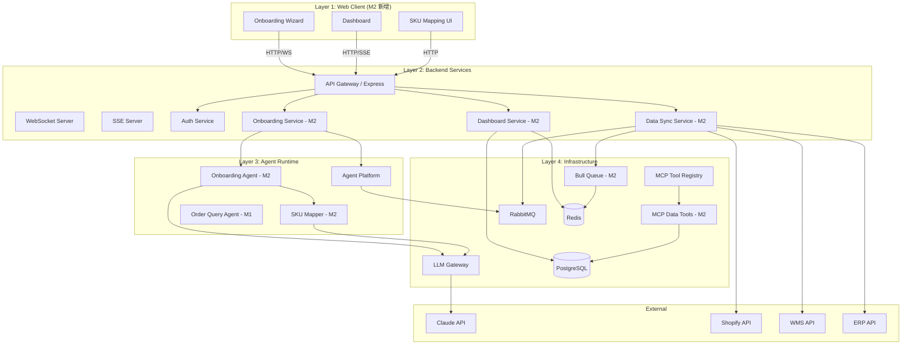
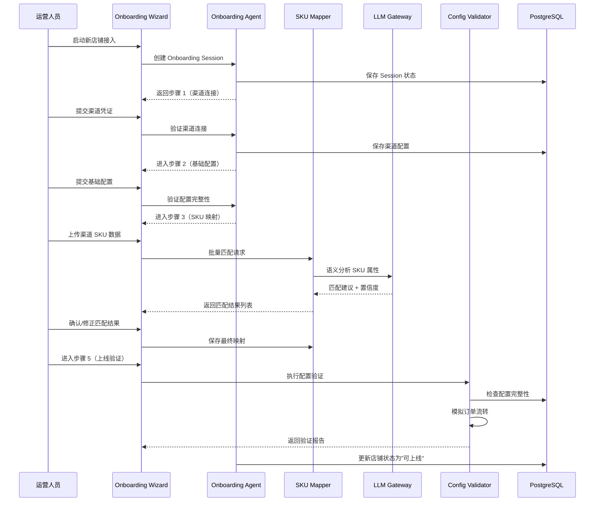
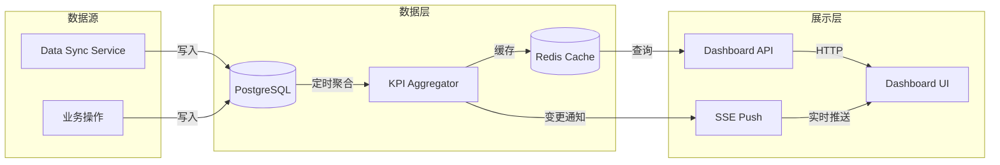

# Design Document: OMS AI Native M2

## Overview

本设计文档描述 OMS AI Native 系统 M2 里程碑的技术架构和实现方案。M2 在 M1 基础设施之上构建面向用户的核心功能层，交付以下关键能力：

1. **Onboarding Agent**：AI 驱动的新手引导 Agent，引导用户完成店铺接入全流程
2. **SKU Mapper**：基于 LLM 的智能 SKU 匹配服务，自动建立渠道 SKU 与系统 SKU 的映射关系
3. **Dashboard Service**：实时数据看板，展示业务 KPI、库存水位和班次任务
4. **Data Sync Service**：多渠道数据同步服务，定时从 Shopify/WMS/ERP 拉取增量数据

### 设计目标

- 新店铺从接入到上线 ≤ 30 分钟
- SKU 自动匹配准确率 ≥ 85%
- Dashboard 数据刷新延迟 ≤ 2 秒
- 数据同步支持增量策略，最小间隔 5 分钟

### M1 复用组件

| 组件 | 复用方式 |
|------|---------|
| PostgreSQL + Redis + RabbitMQ | 直接复用，新增业务表和队列 |
| LLM Gateway | SKU Mapper 通过 Gateway 调用 Claude API |
| Agent SDK Wrapper | Onboarding Agent 基于 SDK 实现会话管理 |
| Agent Platform | 注册 Onboarding Agent，复用生命周期管理 |
| MCP Tool Registry | 注册新的 MCP Data Tools |
| Auth + RBAC | 复用认证鉴权，新增 Dashboard 权限 |
| WebSocket / SSE | 复用实时通信，支持 Onboarding 交互和 Dashboard 推送 |
| 可观测性 | 复用 Trace ID、决策日志、性能指标 |

### M2 新增技术选型

| 组件 | 技术 | 选型理由 |
|------|------|---------|
| 前端框架 | React + TypeScript + Vite | 组件化开发，类型安全，构建速度快 |
| 图表库 | Recharts | 基于 React 组件化，轻量且 API 友好 |
| 数据同步队列 | Bull Queue (基于 Redis) | 已有 Redis 基础设施，支持 Cron 和重试 |
| SKU 匹配 | Claude API (通过 LLM Gateway) | 语义理解能力强，支持结构化输出 |
| 状态管理 | Zustand | 轻量、TypeScript 友好、无 boilerplate |
| HTTP 客户端 | TanStack Query | 缓存管理、自动重试、乐观更新 |

---

## Architecture

### 系统架构图（M2 扩展）



### Onboarding 流程时序图



### Dashboard 数据流



---

## Components and Interfaces

### 1. Onboarding Agent

**职责**：作为 AI Agent 注册在 Agent Platform 上，管理新店铺接入的完整引导流程，包括会话管理、步骤流转和上下文维护。

```typescript
// Onboarding 步骤定义
type OnboardingStep = 
  | 'channel_connection'
  | 'basic_config'
  | 'sku_mapping'
  | 'rule_setup'
  | 'validation';

interface OnboardingSession {
  id: string;
  tenantId: string;
  userId: string;
  shopId: string;
  currentStep: OnboardingStep;
  stepData: Record<OnboardingStep, StepData>;
  startedAt: Date;
  completedSteps: OnboardingStep[];
  metadata: {
    totalDuration?: number;
    interactionCount: number;
  };
}

interface StepData {
  status: 'pending' | 'in_progress' | 'completed' | 'failed';
  data: Record<string, unknown>;
  completedAt?: Date;
  validationErrors?: ValidationError[];
}

interface OnboardingAgentService {
  // 会话管理
  createSession(tenantId: string, userId: string, shopId: string): Promise<OnboardingSession>;
  getSession(sessionId: string): Promise<OnboardingSession>;
  resumeSession(sessionId: string): Promise<OnboardingSession>;
  
  // 步骤流转
  submitStep(sessionId: string, step: OnboardingStep, data: unknown): Promise<StepResult>;
  goBack(sessionId: string): Promise<OnboardingSession>;
  getStepHelp(sessionId: string, step: OnboardingStep): Promise<HelpContent>;
  
  // 验证
  validateStep(sessionId: string, step: OnboardingStep): Promise<ValidationResult>;
  
  // 完成
  completeOnboarding(sessionId: string): Promise<OnboardingReport>;
}

interface StepResult {
  success: boolean;
  nextStep?: OnboardingStep;
  errors?: ValidationError[];
  suggestions?: string[];
}
```

### 2. SKU Mapper

**职责**：利用 LLM 语义分析能力，自动匹配渠道 SKU 与系统 SKU，提供置信度评分和学习能力。

```typescript
interface ChannelSKU {
  id: string;
  channelId: string;
  externalId: string;
  name: string;
  description?: string;
  attributes: Record<string, string>;  // 颜色、尺码、材质等
  price?: number;
  imageUrl?: string;
}

interface SystemSKU {
  id: string;
  tenantId: string;
  sku: string;
  name: string;
  description?: string;
  attributes: Record<string, string>;
  category?: string;
  status: 'active' | 'inactive';
}

interface SKUMatchResult {
  channelSkuId: string;
  systemSkuId: string | null;  // null 表示无匹配
  confidence: number;          // 0-100
  matchType: 'high_confidence' | 'needs_review' | 'no_match';
  reasoning: string;           // LLM 给出的匹配理由
  differencePoints?: string[]; // 差异点（需人工确认时）
  suggestNewSku?: boolean;     // 建议创建新 SKU
}

interface SKUMapperService {
  // 批量匹配
  batchMatch(
    tenantId: string,
    channelSkus: ChannelSKU[],
    options?: MatchOptions
  ): Promise<SKUMatchResult[]>;
  
  // 单条匹配
  matchSingle(
    tenantId: string,
    channelSku: ChannelSKU
  ): Promise<SKUMatchResult>;
  
  // 确认/修正
  confirmMatch(matchId: string, confirmed: boolean, correctedSkuId?: string): Promise<void>;
  
  // 批量导入
  importChannelSkus(tenantId: string, data: ImportData): Promise<ImportResult>;
  
  // 统计
  getAccuracyStats(tenantId: string, sessionId?: string): Promise<AccuracyStats>;
}

interface MatchOptions {
  confidenceThreshold?: number;  // 默认 85
  batchSize?: number;            // LLM 调用批次大小，默认 10
  useLearningData?: boolean;     // 是否使用历史修正数据
}

interface AccuracyStats {
  totalMatches: number;
  correctMatches: number;
  accuracy: number;              // 百分比
  highConfidenceCount: number;
  needsReviewCount: number;
  noMatchCount: number;
}
```

### 3. Dashboard Service

**职责**：聚合业务数据，计算 KPI 指标，提供多维度数据查询和实时推送。

```typescript
interface KPIMetrics {
  orderCount: number;
  fulfillmentRate: number;       // 百分比
  returnRate: number;            // 百分比
  avgProcessingTime: number;     // 分钟
  period: TimePeriod;
  dimensions?: DimensionFilter;
}

type TimeGranularity = 'hour' | 'day' | 'week';

interface TimePeriod {
  start: Date;
  end: Date;
  granularity: TimeGranularity;
}

interface DimensionFilter {
  shopId?: string;
  channelId?: string;
  warehouseId?: string;
}

interface TrendDataPoint {
  timestamp: Date;
  value: number;
  anomaly?: boolean;            // 异常标记
}

interface InventoryLevel {
  warehouseId: string;
  warehouseName: string;
  currentStock: number;
  maxCapacity: number;
  utilizationRate: number;      // 百分比
  turnoverRate: number;         // 周转率
  belowSafetyThreshold: boolean;
}

interface ShiftTask {
  id: string;
  type: 'picking' | 'packing' | 'shipping';
  priority: 'high' | 'medium' | 'low';
  status: 'pending' | 'in_progress' | 'completed';
  deadline?: Date;
  assignee?: string;
}

interface DashboardService {
  // KPI 查询
  getKPIMetrics(tenantId: string, period: TimePeriod, filter?: DimensionFilter): Promise<KPIMetrics>;
  getKPITrend(tenantId: string, metric: string, period: TimePeriod, filter?: DimensionFilter): Promise<TrendDataPoint[]>;
  
  // 库存
  getInventoryLevels(tenantId: string, warehouseId?: string): Promise<InventoryLevel[]>;
  getInventoryTrend(tenantId: string, skuId: string, period: TimePeriod): Promise<TrendDataPoint[]>;
  
  // 班次工作台
  getShiftTasks(tenantId: string, shiftId: string, sort?: SortOptions): Promise<ShiftTask[]>;
  getShiftProgress(tenantId: string, shiftId: string): Promise<ShiftProgress>;
  
  // 实时推送
  subscribeMetrics(tenantId: string, metrics: string[]): AsyncIterable<MetricUpdate>;
}
```

### 4. Data Sync Service

**职责**：管理多渠道数据同步作业，支持增量同步、冲突解决和失败重试。

```typescript
type SyncSource = 'shopify' | 'wms' | 'erp';
type SyncDataType = 'orders' | 'inventory' | 'products';

interface SyncJobConfig {
  id: string;
  tenantId: string;
  source: SyncSource;
  dataType: SyncDataType;
  cronExpression: string;        // e.g., "*/5 * * * *"
  enabled: boolean;
  config: Record<string, unknown>; // 渠道特定配置（API key 等）
  lastSyncAt?: Date;
  lastSyncCursor?: string;       // 增量同步游标
}

interface SyncJobResult {
  jobId: string;
  status: 'success' | 'partial' | 'failed';
  recordsProcessed: number;
  recordsCreated: number;
  recordsUpdated: number;
  conflicts: ConflictRecord[];
  duration: number;              // ms
  error?: string;
}

interface ConflictRecord {
  recordId: string;
  field: string;
  localValue: unknown;
  remoteValue: unknown;
  resolution: 'remote_wins' | 'local_wins' | 'manual';
}

interface DataSyncService {
  // 作业管理
  createSyncJob(config: Omit<SyncJobConfig, 'id'>): Promise<SyncJobConfig>;
  updateSyncJob(jobId: string, updates: Partial<SyncJobConfig>): Promise<SyncJobConfig>;
  deleteSyncJob(jobId: string): Promise<void>;
  listSyncJobs(tenantId: string): Promise<SyncJobConfig[]>;
  
  // 执行
  triggerSync(jobId: string): Promise<SyncJobResult>;
  getSyncHistory(jobId: string, limit?: number): Promise<SyncJobResult[]>;
  
  // 监控
  getSyncStats(tenantId: string): Promise<SyncStats>;
}

interface SyncStats {
  totalJobs: number;
  activeJobs: number;
  lastHourSyncs: number;
  failureRate: number;
  avgDuration: number;
}
```

### 5. Configuration Validator

**职责**：验证店铺配置完整性，模拟订单流转，确保上线前所有配置正确。

```typescript
type ValidationDimension = 
  | 'channel_connection'
  | 'sku_mapping_coverage'
  | 'logistics_rules'
  | 'inventory_association';

interface ValidationCheckResult {
  dimension: ValidationDimension;
  passed: boolean;
  details: string;
  fixSuggestion?: string;
}

interface SimulationResult {
  success: boolean;
  failedAt?: string;           // 失败环节
  errorReason?: string;
  steps: SimulationStep[];
}

interface SimulationStep {
  name: string;
  status: 'passed' | 'failed' | 'skipped';
  duration: number;
  details?: string;
}

interface ValidationReport {
  shopId: string;
  overallStatus: 'pass' | 'fail';
  checks: ValidationCheckResult[];
  simulation: SimulationResult;
  generatedAt: Date;
  canGoLive: boolean;
}

interface ConfigurationValidator {
  validateAll(tenantId: string, shopId: string): Promise<ValidationReport>;
  validateDimension(tenantId: string, shopId: string, dimension: ValidationDimension): Promise<ValidationCheckResult>;
  simulateOrderFlow(tenantId: string, shopId: string): Promise<SimulationResult>;
}
```

### 6. MCP Data Tools

**职责**：为 Agent 提供标准化的 MCP 数据查询工具，支持订单、库存和商品查询。

```typescript
// 订单查询 Tool
interface OrderQueryToolInput {
  tenantId: string;
  orderNo?: string;
  status?: string;
  startDate?: string;
  endDate?: string;
  channelId?: string;
  shopId?: string;
  page?: number;
  pageSize?: number;
}

// 库存查询 Tool
interface InventoryQueryToolInput {
  tenantId: string;
  sku?: string;
  warehouseId?: string;
  belowSafetyLevel?: boolean;
  page?: number;
  pageSize?: number;
}

// 商品/SKU 查询 Tool
interface ProductQueryToolInput {
  tenantId: string;
  name?: string;
  attributes?: Record<string, string>;
  channelId?: string;
  category?: string;
  page?: number;
  pageSize?: number;
}

// MCP Tool 注册定义
const mcpDataTools: MCPToolDefinition[] = [
  {
    name: 'query_orders',
    description: '查询订单信息，支持多条件筛选',
    inputSchema: { /* OrderQueryToolInput JSON Schema */ },
    outputSchema: { /* OrderQueryResult JSON Schema */ },
    version: '1.0.0',
    permissions: ['orders:read'],
    timeout: 10000,
    sandbox: 'v8-isolate',
  },
  {
    name: 'query_inventory',
    description: '查询库存信息，支持按仓库和 SKU 筛选',
    inputSchema: { /* InventoryQueryToolInput JSON Schema */ },
    outputSchema: { /* InventoryQueryResult JSON Schema */ },
    version: '1.0.0',
    permissions: ['inventory:read'],
    timeout: 10000,
    sandbox: 'v8-isolate',
  },
  {
    name: 'query_products',
    description: '查询商品/SKU 信息，支持按名称和属性筛选',
    inputSchema: { /* ProductQueryToolInput JSON Schema */ },
    outputSchema: { /* ProductQueryResult JSON Schema */ },
    version: '1.0.0',
    permissions: ['products:read'],
    timeout: 10000,
    sandbox: 'v8-isolate',
  },
];
```

---

## Data Models

### 新增 PostgreSQL 表

#### shops 表（店铺）

```sql
CREATE TABLE shops (
  id UUID PRIMARY KEY DEFAULT gen_random_uuid(),
  tenant_id UUID NOT NULL REFERENCES tenants(id),
  name VARCHAR(255) NOT NULL,
  channel_type VARCHAR(50) NOT NULL,       -- 'shopify' | 'wms' | 'erp' | 'custom'
  channel_config JSONB DEFAULT '{}',       -- 渠道连接配置（加密存储凭证）
  status VARCHAR(50) DEFAULT 'pending',    -- 'pending' | 'configuring' | 'active' | 'inactive'
  onboarding_session_id UUID,
  created_at TIMESTAMP DEFAULT NOW(),
  updated_at TIMESTAMP DEFAULT NOW()
);

CREATE INDEX idx_shops_tenant_id ON shops(tenant_id);
CREATE INDEX idx_shops_status ON shops(status);
```

#### onboarding_sessions 表

```sql
CREATE TABLE onboarding_sessions (
  id UUID PRIMARY KEY DEFAULT gen_random_uuid(),
  tenant_id UUID NOT NULL REFERENCES tenants(id),
  user_id UUID NOT NULL REFERENCES users(id),
  shop_id UUID NOT NULL REFERENCES shops(id),
  current_step VARCHAR(50) NOT NULL DEFAULT 'channel_connection',
  completed_steps TEXT[] DEFAULT '{}',
  step_data JSONB DEFAULT '{}',
  status VARCHAR(50) DEFAULT 'in_progress',  -- 'in_progress' | 'completed' | 'abandoned'
  interaction_count INTEGER DEFAULT 0,
  started_at TIMESTAMP DEFAULT NOW(),
  completed_at TIMESTAMP,
  total_duration_ms INTEGER
);

CREATE INDEX idx_onboarding_sessions_tenant_id ON onboarding_sessions(tenant_id);
CREATE INDEX idx_onboarding_sessions_shop_id ON onboarding_sessions(shop_id);
CREATE INDEX idx_onboarding_sessions_status ON onboarding_sessions(status);
```

#### system_skus 表

```sql
CREATE TABLE system_skus (
  id UUID PRIMARY KEY DEFAULT gen_random_uuid(),
  tenant_id UUID NOT NULL REFERENCES tenants(id),
  sku VARCHAR(100) NOT NULL,
  name VARCHAR(255) NOT NULL,
  description TEXT,
  attributes JSONB DEFAULT '{}',
  category VARCHAR(100),
  status VARCHAR(50) DEFAULT 'active',
  created_at TIMESTAMP DEFAULT NOW(),
  updated_at TIMESTAMP DEFAULT NOW(),
  UNIQUE(tenant_id, sku)
);

CREATE INDEX idx_system_skus_tenant_id ON system_skus(tenant_id);
CREATE INDEX idx_system_skus_category ON system_skus(category);
```

#### channel_skus 表

```sql
CREATE TABLE channel_skus (
  id UUID PRIMARY KEY DEFAULT gen_random_uuid(),
  tenant_id UUID NOT NULL REFERENCES tenants(id),
  shop_id UUID NOT NULL REFERENCES shops(id),
  external_id VARCHAR(255) NOT NULL,
  name VARCHAR(255) NOT NULL,
  description TEXT,
  attributes JSONB DEFAULT '{}',
  price DECIMAL(12, 2),
  image_url TEXT,
  imported_at TIMESTAMP DEFAULT NOW(),
  UNIQUE(tenant_id, shop_id, external_id)
);

CREATE INDEX idx_channel_skus_tenant_id ON channel_skus(tenant_id);
CREATE INDEX idx_channel_skus_shop_id ON channel_skus(shop_id);
```

#### sku_mappings 表

```sql
CREATE TABLE sku_mappings (
  id UUID PRIMARY KEY DEFAULT gen_random_uuid(),
  tenant_id UUID NOT NULL REFERENCES tenants(id),
  channel_sku_id UUID NOT NULL REFERENCES channel_skus(id),
  system_sku_id UUID REFERENCES system_skus(id),  -- null 表示未匹配
  confidence SMALLINT NOT NULL CHECK (confidence >= 0 AND confidence <= 100),
  match_type VARCHAR(50) NOT NULL,                 -- 'high_confidence' | 'needs_review' | 'no_match'
  reasoning TEXT,
  status VARCHAR(50) DEFAULT 'pending',            -- 'pending' | 'confirmed' | 'rejected' | 'corrected'
  confirmed_by UUID REFERENCES users(id),
  confirmed_at TIMESTAMP,
  created_at TIMESTAMP DEFAULT NOW(),
  updated_at TIMESTAMP DEFAULT NOW(),
  UNIQUE(tenant_id, channel_sku_id)
);

CREATE INDEX idx_sku_mappings_tenant_id ON sku_mappings(tenant_id);
CREATE INDEX idx_sku_mappings_status ON sku_mappings(status);
CREATE INDEX idx_sku_mappings_match_type ON sku_mappings(match_type);
```

#### sku_mapping_corrections 表（学习样本）

```sql
CREATE TABLE sku_mapping_corrections (
  id UUID PRIMARY KEY DEFAULT gen_random_uuid(),
  tenant_id UUID NOT NULL REFERENCES tenants(id),
  mapping_id UUID NOT NULL REFERENCES sku_mappings(id),
  original_system_sku_id UUID REFERENCES system_skus(id),
  corrected_system_sku_id UUID NOT NULL REFERENCES system_skus(id),
  channel_sku_attributes JSONB NOT NULL,
  corrected_by UUID NOT NULL REFERENCES users(id),
  created_at TIMESTAMP DEFAULT NOW()
);

CREATE INDEX idx_sku_mapping_corrections_tenant_id ON sku_mapping_corrections(tenant_id);
```

#### inventory 表

```sql
CREATE TABLE inventory (
  id UUID PRIMARY KEY DEFAULT gen_random_uuid(),
  tenant_id UUID NOT NULL REFERENCES tenants(id),
  system_sku_id UUID NOT NULL REFERENCES system_skus(id),
  warehouse_id VARCHAR(100) NOT NULL,
  quantity INTEGER NOT NULL DEFAULT 0,
  safety_threshold INTEGER DEFAULT 10,
  max_capacity INTEGER,
  last_sync_at TIMESTAMP,
  created_at TIMESTAMP DEFAULT NOW(),
  updated_at TIMESTAMP DEFAULT NOW(),
  UNIQUE(tenant_id, system_sku_id, warehouse_id)
);

CREATE INDEX idx_inventory_tenant_id ON inventory(tenant_id);
CREATE INDEX idx_inventory_warehouse_id ON inventory(warehouse_id);
CREATE INDEX idx_inventory_system_sku_id ON inventory(system_sku_id);
```

#### warehouses 表

```sql
CREATE TABLE warehouses (
  id UUID PRIMARY KEY DEFAULT gen_random_uuid(),
  tenant_id UUID NOT NULL REFERENCES tenants(id),
  code VARCHAR(100) NOT NULL,
  name VARCHAR(255) NOT NULL,
  max_capacity INTEGER,
  status VARCHAR(50) DEFAULT 'active',
  config JSONB DEFAULT '{}',
  created_at TIMESTAMP DEFAULT NOW(),
  updated_at TIMESTAMP DEFAULT NOW(),
  UNIQUE(tenant_id, code)
);

CREATE INDEX idx_warehouses_tenant_id ON warehouses(tenant_id);
```

#### kpi_aggregations 表（预聚合 KPI 数据）

```sql
CREATE TABLE kpi_aggregations (
  id UUID PRIMARY KEY DEFAULT gen_random_uuid(),
  tenant_id UUID NOT NULL REFERENCES tenants(id),
  metric_name VARCHAR(100) NOT NULL,       -- 'order_count' | 'fulfillment_rate' | 'return_rate' | 'avg_processing_time'
  granularity VARCHAR(20) NOT NULL,        -- 'hour' | 'day' | 'week'
  period_start TIMESTAMP NOT NULL,
  period_end TIMESTAMP NOT NULL,
  value DECIMAL(12, 4) NOT NULL,
  dimensions JSONB DEFAULT '{}',           -- { shopId, channelId, warehouseId }
  created_at TIMESTAMP DEFAULT NOW(),
  UNIQUE(tenant_id, metric_name, granularity, period_start, dimensions)
);

CREATE INDEX idx_kpi_aggregations_tenant_id ON kpi_aggregations(tenant_id);
CREATE INDEX idx_kpi_aggregations_metric ON kpi_aggregations(metric_name);
CREATE INDEX idx_kpi_aggregations_period ON kpi_aggregations(period_start, period_end);
```

#### sync_jobs 表

```sql
CREATE TABLE sync_jobs (
  id UUID PRIMARY KEY DEFAULT gen_random_uuid(),
  tenant_id UUID NOT NULL REFERENCES tenants(id),
  source VARCHAR(50) NOT NULL,             -- 'shopify' | 'wms' | 'erp'
  data_type VARCHAR(50) NOT NULL,          -- 'orders' | 'inventory' | 'products'
  cron_expression VARCHAR(100) NOT NULL,
  enabled BOOLEAN DEFAULT true,
  config JSONB DEFAULT '{}',
  last_sync_at TIMESTAMP,
  last_sync_cursor VARCHAR(255),
  created_at TIMESTAMP DEFAULT NOW(),
  updated_at TIMESTAMP DEFAULT NOW()
);

CREATE INDEX idx_sync_jobs_tenant_id ON sync_jobs(tenant_id);
CREATE INDEX idx_sync_jobs_enabled ON sync_jobs(enabled);
```

#### sync_job_runs 表

```sql
CREATE TABLE sync_job_runs (
  id UUID PRIMARY KEY DEFAULT gen_random_uuid(),
  job_id UUID NOT NULL REFERENCES sync_jobs(id),
  tenant_id UUID NOT NULL REFERENCES tenants(id),
  status VARCHAR(50) NOT NULL,             -- 'running' | 'success' | 'partial' | 'failed'
  records_processed INTEGER DEFAULT 0,
  records_created INTEGER DEFAULT 0,
  records_updated INTEGER DEFAULT 0,
  conflicts JSONB DEFAULT '[]',
  duration_ms INTEGER,
  error_message TEXT,
  retry_count INTEGER DEFAULT 0,
  started_at TIMESTAMP DEFAULT NOW(),
  completed_at TIMESTAMP
);

CREATE INDEX idx_sync_job_runs_job_id ON sync_job_runs(job_id);
CREATE INDEX idx_sync_job_runs_tenant_id ON sync_job_runs(tenant_id);
CREATE INDEX idx_sync_job_runs_status ON sync_job_runs(status);
CREATE INDEX idx_sync_job_runs_started_at ON sync_job_runs(started_at);
```

#### validation_reports 表

```sql
CREATE TABLE validation_reports (
  id UUID PRIMARY KEY DEFAULT gen_random_uuid(),
  tenant_id UUID NOT NULL REFERENCES tenants(id),
  shop_id UUID NOT NULL REFERENCES shops(id),
  session_id UUID REFERENCES onboarding_sessions(id),
  overall_status VARCHAR(20) NOT NULL,     -- 'pass' | 'fail'
  checks JSONB NOT NULL,                   -- ValidationCheckResult[]
  simulation JSONB NOT NULL,               -- SimulationResult
  can_go_live BOOLEAN NOT NULL DEFAULT false,
  created_at TIMESTAMP DEFAULT NOW()
);

CREATE INDEX idx_validation_reports_tenant_id ON validation_reports(tenant_id);
CREATE INDEX idx_validation_reports_shop_id ON validation_reports(shop_id);
```

### Redis 数据结构（M2 新增）

```
# Onboarding Session 缓存（TTL: 2 hours）
onboarding:{sessionId}:state -> JSON (current step, step data)

# KPI 聚合缓存（TTL: 根据粒度不同）
kpi:{tenantId}:{metric}:{granularity}:{periodStart} -> JSON (value, dimensions)

# Dashboard 实时指标（TTL: 60s）
dashboard:{tenantId}:realtime -> JSON (latest metrics snapshot)

# SKU 匹配缓存（TTL: 5 min）
sku_match:{tenantId}:{channelSkuHash} -> JSON (match result)

# 同步作业锁（TTL: job timeout）
sync_lock:{jobId} -> String (worker ID)

# Bull Queue 使用 Redis 存储作业数据
bull:data-sync:{jobId} -> JSON (job data)
```

---

## Correctness Properties

*A property is a characteristic or behavior that should hold true across all valid executions of a system—essentially, a formal statement about what the system should do. Properties serve as the bridge between human-readable specifications and machine-verifiable correctness guarantees.*

### Property 1: Onboarding 会话初始状态

*For any* 有效的 tenant/user/shop 组合，创建 Onboarding Session 后，会话 SHALL 处于 `channel_connection` 步骤，completedSteps 为空数组，interactionCount 为 0，status 为 `in_progress`。

**Validates: Requirements 1.2**

### Property 2: 步骤验证门控

*For any* Onboarding Session 和任意步骤数据，当步骤验证失败时，currentStep SHALL 保持不变且 completedSteps 不增长；当步骤验证通过时，currentStep SHALL 前进到下一步骤且当前步骤被加入 completedSteps。

**Validates: Requirements 1.4**

### Property 3: 步骤数据回退保留（Round-Trip）

*For any* Onboarding Session 中已完成的步骤及其数据，执行回退操作后，该步骤的已填写数据 SHALL 与回退前完全一致。

**Validates: Requirements 1.6**

### Property 4: SKU 置信度分类正确性

*For any* SKU 匹配结果的置信度分数 c（0 ≤ c ≤ 100），当 c ≥ 85 时 matchType SHALL 为 `high_confidence`；当 0 < c < 85 时 matchType SHALL 为 `needs_review` 且 differencePoints 非空；当 c = 0 且无匹配时 matchType SHALL 为 `no_match`。

**Validates: Requirements 2.2, 2.3, 2.4**

### Property 5: 批量导入记录数保持

*For any* 有效的 Channel SKU 批量导入数据（CSV 或 API 格式），导入完成后数据库中新增的 channel_skus 记录数 SHALL 等于输入数据中的有效记录数。

**Validates: Requirements 2.6**

### Property 6: 无匹配时建议创建新 SKU

*For any* Channel SKU，当系统中不存在语义匹配的 System SKU 时，匹配结果的 suggestNewSku SHALL 为 true，且预填的属性信息 SHALL 包含原始 Channel SKU 的 name 和 attributes。

**Validates: Requirements 2.7**

### Property 7: 配置验证完整性

*For any* 店铺配置，Configuration Validator 的验证结果 SHALL 包含所有 4 个维度（渠道连接、SKU 映射覆盖率、物流规则、库存关联）的明确通过/未通过状态；当且仅当所有维度通过时，canGoLive SHALL 为 true；当存在未通过维度时，每个未通过项 SHALL 附带修复建议。

**Validates: Requirements 3.1, 3.2, 3.5, 3.6**

### Property 8: 表单输入验证正确性

*For any* Onboarding 步骤的配置字段和输入值，验证函数 SHALL 满足：符合字段规则的输入被接受，不符合规则的输入被拒绝并返回包含具体字段名和原因的错误信息。

**Validates: Requirements 4.2, 4.3**

### Property 9: Onboarding 导航与级联重验证

*For any* 已完成 N 个步骤的 Onboarding Session，跳转到任意已完成步骤 K（K ≤ N）SHALL 成功；修改步骤 K 的数据后，所有步骤 K+1 到 N 的 status SHALL 被重置为需要重新验证。

**Validates: Requirements 4.4, 4.5**

### Property 10: 会话状态持久化 Round-Trip

*For any* Onboarding Session 状态（包含 currentStep、stepData、completedSteps），序列化存储到 Redis/DB 后再反序列化恢复，恢复后的状态 SHALL 与原始状态完全一致。

**Validates: Requirements 4.6**

### Property 11: KPI 指标响应完整性与粒度正确性

*For any* 有效的时间段和粒度（hour/day/week），Dashboard 返回的 KPI 数据 SHALL 包含所有 4 个核心指标（orderCount、fulfillmentRate、returnRate、avgProcessingTime）；返回的趋势数据点间隔 SHALL 与请求的粒度一致（hour=1h, day=1d, week=7d）。

**Validates: Requirements 5.1, 5.2**

### Property 12: Dashboard 数据过滤与租户隔离

*For any* Dashboard 查询（KPI、库存、任务），返回的所有数据记录 SHALL 仅属于请求中指定的 tenantId；当指定维度筛选条件（shopId/channelId/warehouseId）时，返回数据 SHALL 仅包含匹配该条件的记录。

**Validates: Requirements 5.4, 5.6, 9.7, 10.5**

### Property 13: 异常波动检测

*For any* KPI 时间序列数据，当某数据点的值偏离移动平均值超过 2 个标准差时，该数据点的 anomaly 标记 SHALL 为 true；偏离在 2 个标准差以内时 SHALL 为 false。

**Validates: Requirements 5.5**

### Property 14: 库存水位计算与预警

*For any* 仓库的库存数据（currentStock, maxCapacity, safetyThreshold），utilizationRate SHALL 等于 currentStock/maxCapacity × 100（精度误差 ≤ 0.01）；当 currentStock < safetyThreshold 时 belowSafetyThreshold SHALL 为 true，否则为 false。

**Validates: Requirements 7.1, 7.3**

### Property 15: 班次任务过滤、排序与进度计算

*For any* 任务集合和班次 ID，返回的任务列表 SHALL 仅包含属于该班次的任务；按优先级排序时 high < medium < low；进度计算 SHALL 等于 completedCount/totalCount；交接任务数 SHALL 等于上一班次中 status ≠ 'completed' 的任务数。

**Validates: Requirements 8.1, 8.2, 8.4, 8.5**

### Property 16: 同步频率验证

*For any* Cron 表达式，当其表示的执行间隔 < 5 分钟或 > 24 小时时，验证 SHALL 拒绝该配置；当间隔在 [5min, 24h] 范围内时 SHALL 接受。

**Validates: Requirements 9.2**

### Property 17: 增量同步游标正确性

*For any* 同步作业执行，处理的数据记录 SHALL 仅包含时间戳晚于 lastSyncCursor 的记录；执行完成后 lastSyncCursor SHALL 更新为本次处理的最新记录时间戳。

**Validates: Requirements 9.3**

### Property 18: 同步重试指数退避

*For any* 失败的同步作业，第 N 次重试的延迟 SHALL 等于 baseDelay × 2^(N-1)（N ∈ {1,2,3}）；超过 3 次重试后 SHALL 标记为最终失败不再重试。

**Validates: Requirements 9.4**

### Property 19: 同步冲突解决（渠道优先）

*For any* 本地数据与远程数据的冲突，解决后的最终值 SHALL 等于远程（渠道）数据的值；冲突记录 SHALL 包含 recordId、field、localValue、remoteValue 和 resolution='remote_wins'。

**Validates: Requirements 9.6**

### Property 20: 同步运行记录完整性

*For any* 同步作业执行（无论成功或失败），运行记录 SHALL 包含 records_processed、records_created、records_updated、duration_ms 和 status 字段，且 records_created + records_updated ≤ records_processed。

**Validates: Requirements 9.5**

### Property 21: MCP 查询过滤正确性

*For any* MCP Data Tool 查询（订单/库存/商品）和任意过滤条件组合，返回的结果集 SHALL 恰好包含满足所有指定条件的记录，不多不少。

**Validates: Requirements 10.1, 10.2, 10.3**

### Property 22: MCP 无效输入错误结构

*For any* 不符合 MCP Tool 输入 schema 的请求参数，返回的错误响应 SHALL 包含结构化信息：具体的违规字段名、期望类型/格式和实际值。

**Validates: Requirements 10.6**

### Property 23: SKU 匹配准确率计算

*For any* 已确认的 SKU 匹配结果集合（confirmed + corrected），准确率 SHALL 等于 confirmed 数量 / (confirmed + corrected) 数量 × 100%，精度误差 ≤ 0.01。

**Validates: Requirements 12.1**

### Property 24: 低准确率预警

*For any* SKU 映射会话的准确率统计，当准确率 < 85% 时，报告 SHALL 包含数据质量警告标记和检查建议；当准确率 ≥ 85% 时 SHALL 不包含警告。

**Validates: Requirements 12.5**

---

## Error Handling

### 错误分层策略（M2 新增）

| 层级 | 错误类型 | 处理策略 |
|------|---------|---------|
| Onboarding Agent | 步骤验证失败、会话超时 | 返回具体错误 + 修复建议，不阻断流程 |
| SKU Mapper | LLM 调用失败、批量处理超时 | 重试 → 降级为规则匹配 → 标记为需人工处理 |
| Dashboard Service | 聚合查询超时、缓存失效 | 返回缓存数据（标记为非实时）→ 降级为粗粒度 |
| Data Sync Service | 渠道 API 失败、数据冲突 | 指数退避重试 → 记录冲突 → 告警 |
| Configuration Validator | 渠道连接失败、模拟失败 | 定位失败环节 → 提供修复建议 |
| MCP Data Tools | 参数校验失败、查询超时 | 返回结构化错误 → 缓存降级 |

### SKU Mapper 降级策略

```typescript
interface SKUMatcherFallback {
  // 级别 1：LLM 匹配（正常模式）
  llmMatch(channelSku: ChannelSKU, systemSkus: SystemSKU[]): Promise<SKUMatchResult>;
  
  // 级别 2：规则匹配（LLM 不可用时降级）
  ruleBasedMatch(channelSku: ChannelSKU, systemSkus: SystemSKU[]): SKUMatchResult;
  
  // 级别 3：标记为需人工处理（规则匹配也失败时）
  markForManualReview(channelSku: ChannelSKU): SKUMatchResult;
}

// 规则匹配策略
const ruleMatchStrategies = [
  'exact_name_match',        // SKU 名称完全匹配
  'normalized_name_match',   // 标准化后名称匹配
  'attribute_similarity',    // 属性相似度 > 阈值
  'historical_correction',   // 基于历史修正数据匹配
];
```

### Data Sync 重试配置

```typescript
const syncRetryConfig = {
  maxRetries: 3,
  baseDelay: 60000,          // 1 分钟
  maxDelay: 900000,          // 15 分钟
  backoffMultiplier: 2,
  retryableErrors: [
    'NETWORK_TIMEOUT',
    'RATE_LIMIT',
    'SERVICE_UNAVAILABLE',
    'CONNECTION_RESET',
  ],
  nonRetryableErrors: [
    'AUTH_FAILED',
    'INVALID_CONFIG',
    'PERMISSION_DENIED',
  ],
};
```

### Dashboard 缓存降级

```typescript
interface DashboardCacheStrategy {
  // 实时数据（TTL: 60s）
  realtime: { ttl: 60, fallback: 'stale_cache' };
  // 小时粒度（TTL: 5min）
  hourly: { ttl: 300, fallback: 'last_known' };
  // 天粒度（TTL: 1h）
  daily: { ttl: 3600, fallback: 'last_known' };
  // 周粒度（TTL: 6h）
  weekly: { ttl: 21600, fallback: 'last_known' };
}
```

---

## Testing Strategy

### 测试分层

```
┌─────────────────────────────────────────────────────────────┐
│  E2E Tests (端到端)                                          │
│  - Onboarding 全流程（创建→配置→SKU映射→验证→上线）            │
│  - Dashboard 数据展示完整链路                                  │
├─────────────────────────────────────────────────────────────┤
│  Integration Tests (集成测试)                                 │
│  - SKU Mapper + LLM Gateway (Mock Claude)                    │
│  - Data Sync + Bull Queue + External APIs (Mock)             │
│  - Dashboard + PostgreSQL + Redis                            │
│  - MCP Data Tools + Database                                 │
├─────────────────────────────────────────────────────────────┤
│  Property-Based Tests (属性测试)                              │
│  - SKU 置信度分类逻辑                                         │
│  - 配置验证完整性                                             │
│  - KPI 聚合与过滤                                            │
│  - 同步冲突解决                                              │
│  - 步骤状态机转换                                             │
├─────────────────────────────────────────────────────────────┤
│  Unit Tests (单元测试)                                        │
│  - 各组件独立功能                                             │
│  - 数据格式转换                                              │
│  - 错误处理逻辑                                              │
│  - 前端组件渲染                                              │
└─────────────────────────────────────────────────────────────┘
```

### Property-Based Testing 配置

**测试库**：fast-check（已在 M1 中引入，版本 3.23.2）+ @fast-check/vitest

**配置要求**：
- 每个 property test 最少运行 100 次迭代
- 每个 test 必须通过注释引用设计文档中的 property
- Tag 格式：`Feature: oms-ai-native-m2, Property {number}: {property_text}`

**Property Test 覆盖范围**：

| Property | 测试重点 | Generator 策略 |
|----------|---------|---------------|
| P1: 会话初始状态 | 创建会话后验证初始字段 | 随机 UUID 组合 |
| P2: 步骤门控 | 有效/无效数据的步骤推进 | 随机步骤数据（含缺失字段） |
| P3: 数据回退保留 | 前进后回退验证数据不变 | 随机步骤数据序列 |
| P4: 置信度分类 | 各种置信度分数的分类 | 随机 0-100 整数 |
| P7: 配置验证完整性 | 各种配置组合的验证结果 | 随机配置（含缺失项） |
| P8: 表单验证 | 各种输入的校验结果 | 随机字符串/数字/对象 |
| P10: 状态持久化 | 序列化/反序列化 round-trip | 随机会话状态对象 |
| P11: KPI 粒度 | 不同粒度的数据点间隔 | 随机时间段 + 粒度 |
| P12: 数据过滤 | 多维度筛选正确性 | 随机数据集 + 过滤条件 |
| P13: 异常检测 | 已知异常点的检测 | 随机时间序列 + 注入异常 |
| P14: 库存计算 | 水位和阈值计算 | 随机库存数值 |
| P15: 班次任务 | 过滤/排序/进度 | 随机任务集合 |
| P16: 频率验证 | Cron 表达式范围检查 | 随机 Cron 表达式 |
| P17: 增量同步 | 游标过滤正确性 | 随机时间戳数据集 |
| P18: 重试退避 | 延迟计算 | 随机重试次数 |
| P19: 冲突解决 | 远程优先策略 | 随机冲突数据对 |
| P20: 记录完整性 | 运行记录字段检查 | 随机同步结果 |
| P21: MCP 过滤 | 查询条件匹配 | 随机数据 + 查询参数 |
| P22: 错误结构 | 无效输入的错误格式 | 随机无效 JSON |
| P23: 准确率计算 | 公式正确性 | 随机确认/修正数量 |
| P24: 低准确率预警 | 阈值判断 | 随机准确率值 |

### Unit Test 覆盖范围

| 组件 | 测试重点 |
|------|---------|
| Onboarding Agent | 会话 CRUD、步骤流转逻辑、帮助内容 |
| SKU Mapper | LLM prompt 构造、结果解析、降级逻辑 |
| Dashboard Service | KPI 聚合查询、缓存策略、SSE 推送 |
| Data Sync Service | 作业调度、增量拉取、冲突检测 |
| Configuration Validator | 各维度检查逻辑、模拟流程 |
| MCP Data Tools | Schema 定义、参数校验、查询构造 |
| 前端组件 | Onboarding Wizard 步骤条、Dashboard 图表、SKU 映射表格 |

### Integration Test 覆盖范围

| 场景 | 验证内容 |
|------|---------|
| Onboarding 全流程 | 创建会话 → 各步骤提交 → SKU 映射 → 验证 → 上线 |
| SKU 匹配链路 | SKU Mapper → LLM Gateway (Mock) → 结果存储 |
| 数据同步链路 | Bull Queue → Sync Worker → External API (Mock) → DB 写入 |
| Dashboard 数据链路 | 数据写入 → KPI 聚合 → 缓存 → API 查询 |
| MCP Tool 链路 | Tool Registry → Data Tool → DB 查询 → 结果返回 |
| 租户隔离 | 多租户并发操作，验证数据隔离 |

### 前端测试策略

| 类型 | 工具 | 覆盖范围 |
|------|------|---------|
| 组件测试 | Vitest + React Testing Library | 各 UI 组件渲染和交互 |
| 集成测试 | Vitest + MSW (Mock Service Worker) | API 调用和状态管理 |
| E2E 测试 | Playwright | 关键用户流程 |
| 视觉回归 | Storybook + Chromatic | UI 组件样式一致性 |

### 测试环境

| 环境 | 用途 | 配置 |
|------|------|------|
| Unit/Property | 本地开发 | Mock 所有外部依赖 |
| Integration | CI/CD | Docker Compose（PostgreSQL + Redis + RabbitMQ） |
| E2E | Staging | 完整后端 + Mock 外部 API（Shopify/WMS/ERP） |
| 前端 | 本地/CI | Vite Dev Server + MSW |
